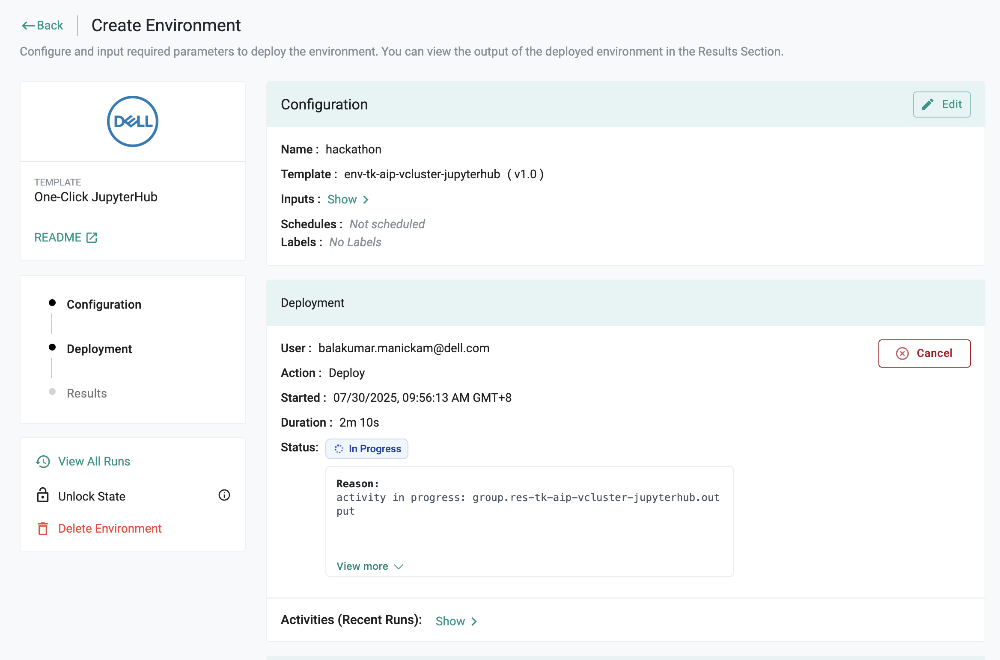

# AI Hackathon

This Hands-on Lab offers a fully guided and immersive experience designed to provide a fun and engaging way to explore generative AI technologies, all within a virtual environment that requires no complex setup or installation.

Participants will get access to a GPU-powered Ubuntu environment preconfigured with essential tools such as Playwright, Tesseract OCR, and Ollama, enabling rapid experimentation and hands-on development. The lab has been purpose-built for this Kahoot Hackathon to empower teams to explore AI-driven automation in real-time interactive scenarios.

Throughout this lab, you will build and enhance an agent capable of joining live Kahoot quizzes, capturing questions from the screen, processing them using OCR, and selecting answers using a locally running large language model (LLM). This challenge-driven environment encourages creativity, iteration, and performance tuning, all while showcasing practical applications of AI integration, browser automation, and high-speed inference.

# Lab Introduction

Before you begin this Hands-on Lab, please take note of the details below to help you along as you proceed through the modules.

**Lab Rules:**\
Please DON'T Change any IP addresses\
Please DON'T Shutdown management or iSCSI interfaces\
Please DON'T run performance tests\
Please DON'T delete Hosts or Host Groups this will impact other users\
Please DON'T Delete ANYTHING that you have not created

1\. Now let's get started!

Visit Rafay admin portal using the URL shared by the trainer and login with your credentials. Navigate to `ai-partner-day` -> `Go to Project`

2\. Go to `Environments` -> `Environments` in the side panel and click `One-Click JupyterHub` -> `Launch` (the one you created in RAFAY session)

3\. Enter the `name` for the environment and click `Save and Deploy`

4\. Wait until the environment is ready

Once the environment is ready, you will see the status `Success` and `Jupyter-Hub` URL.

5\. Go to the `Jupyter-Hub` URL, and login with the credentials provided:

| Field    | Details     |
| -------- | ----------- |
| Username    | admin |
| Password | password    |

6\. Launch the JupyterLab by clicking `Start`

7\. You will see the JupyterLab Launcher as shown below,

8\. Open the terminal from the Launcher.

9\. Create & cd to the directory `/home/jovyan/workspace`.

> Commands: \
`mkdir /home/jovyan/workspace` \
`cd /home/jovyan/workspace`

10\. Clone the git repository and cd to the directory.

> Commands: \
`git clone https://github.com/apj-aih/ai-hackathon-starter.git` \
`cd ai-hackathon-starter`

11\. Run the `setup_ollama.sh` to prepare the environment for hackathon.

> Commands: \
`chmod +x setup_ollama.sh` \
`./setup_ollama.sh`

This script will install Ollama and pull necessary GenAI models for the hackathon. 

12\. Let's list the models available in Ollama using the command `ollama list`

13\. Browse to the folder from the left panel - `/workspace/ai-hackathon`

14\. Open the Jupyter Notebook `00_setup_environment.ipynb` This notebook is to install all the required dependencies.

15\. Click `run all cells` using `>>` icon

16\. Click 'Restart'

17\. Wait until you see '✅ Done!' for the last code cell. This ensures all the dependencies are installed successfully.

