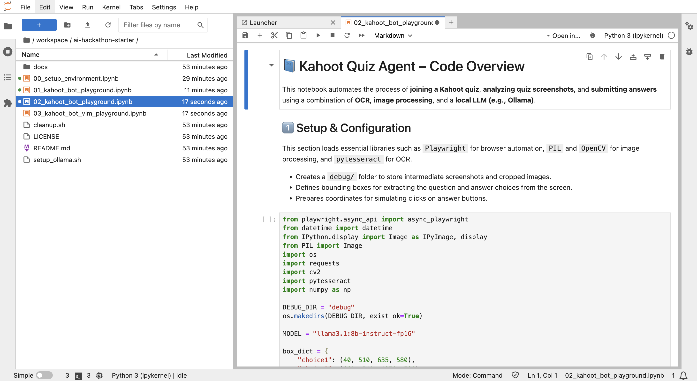

# Module 2

There are more sample Jupyter Notebooks available for your reference to play the Kahoot Quiz. Use it to improve your own code.

1\. Open the terminal from the Launcher.

2\. Create & cd to folder `/home/jovyan/workspace/git` in the terminal

> Commands: \
`mkdir /home/jovyan/workspace/git` \
`cd /home/jovyan/workspace/git`

Clone ai-hackathon git repo to the git directory:

> Commands: \
`git clone https://github.com/apj-aih/ai-hackathon.git`

3\. In the left panel, browse to the folder `/workspace/git/ai-hackathon`

4\. There are two new files `02_kahoot_bot_playground.ipynb` and `03_kahoot_bot_vlm_playground.ipynb`, copy both the files (right click and copy)

5\. Go back to the folder `/workspace/ai-hackathon-starter`

6\. Right click and paste. These two new files will be copied to your working folder.

7\. `02_kahoot_bot_playground.ipynb` is the enhanced version of using OCR

8\. `03_kahoot_bot_vlm_playground.ipynb` is the enhanced version using VLM model.

> Tip! Take these files as the reference & play the quiz to win it.
